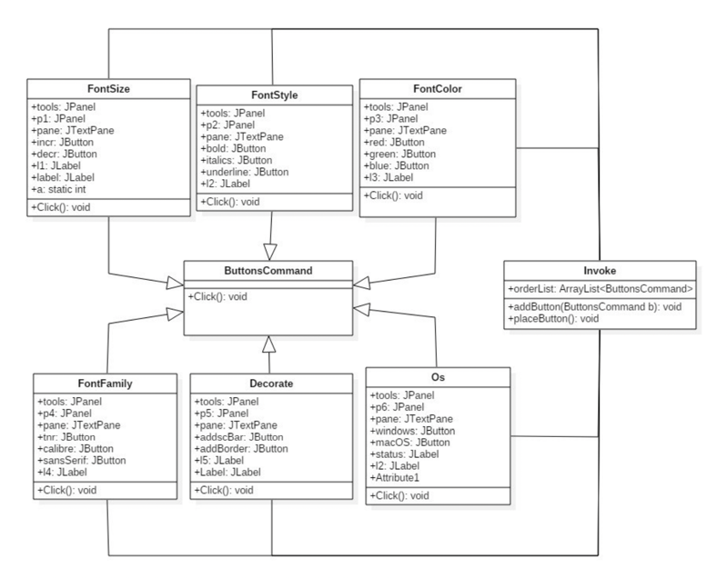
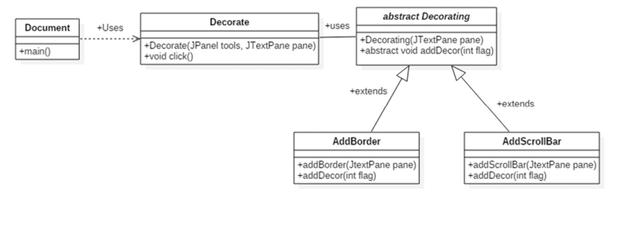

# Document Editor

# Abstract

Design patterns represent the best practices used by experienced object-oriented software developers. Design patterns
are solutions to general problems that software developers faced during software development. These solutions were
obtained by trial and error by numerous software developers over quite a substantial period of time. Here in this case
study, we use various design patterns to solve the design issues relating to the application of a WYSIWYG (What You See
Is What You Get) document editor.

# Introduction

This application is based in a case study in the design of a “What-You-See-Is-What-You-Get” for (WYSIWUG) document
editor called Lexi. Various design patterns capture the solutions to design problems in Lexi and applications like it. A
WYSIWYG representation of a document occupies a large rectangular area in the center . The document can ideally mix text
and graphics freely in a variety of formatting styles. Surrounding the document are the usual pull down menus and the
scroll bars.

# Working Video

Click [here](DocumentEditorMaven/src/main/resources/working-video.mov) to view the working video

# Design Patterns Used

## Composite Design Pattern

### Intent

The formal definition of the Composite Pattern says that it allows you to compose objects into tree structures to
represent part whole hierarchies. Composite[8][9][9] lets clients to treat individual objects and compositions of
objects uniformly. The Composite[8][9][9] Pattern allows us to build structures of objects in the form of trees that
contains both composition of objects and individual objects as nodes. Using a composite structure, we can apply the same
operations over both composites and individual objects. In other words, in most cases we can ignore the differences
between compositions of objects and individual objects.

### Motivation

- Graphics applications like drawing editors and schematics capture systems let users build complex diagrams out of
  simple components.
- The users can group components to form larger components, which in turn can be group to form still larger components.
- A simple implementation could define classes for graphical primitives such as Text and Lines plus other classes that
  acts as containers for primitives.
- But there’s a problem with this approach: Code that uses these classes must treat primitives and container objects
  differently, even if most of the time the user treats them identically. Having to distinguish these objects makes the
  application more complex.
- The composite pattern describes how to use recursive composition so that clients don’t have to make this distinction.
- The key to the Composite[8][9][9] pattern is an abstract class that represents both primitives and their containers.

### Participants

- Component
- Leaf
- Composite
- Client

### General Structure

|  |
|:------------------------------------------------------------------------------------------------------------:|
|                             <b>General Structure - Composite Design Pattern</b>                              |

### Document Editor Specific Structure

|  |
|:-------------------------------------------------------------------------------------------------------------:|
|                     <b>Document Editor Specific Structure - Composite Design Pattern</b>                      |

### Recursive Composition

A common way of representing hierarchically structured information is through a technique called recursive composition.
It entails building increasingly complex elements out of simpler ones. Recursive composition gives us a way to compose a
document out of simple graphical elements. As a first step, we can tile a set of characters and graphics to form a line
in the document. Then, multiple lines can be arranged to form a column and multiple columns can form a page.

### Working in the code

In the document editor that has been designed, the composite design pattern has been used to construct the user
interface of the document editor. The interface has two methods, addComposite and addLeaf(). The panels are added in the
addComposite method since there will be more components to be added in the panel such as buttons and labels whereas the
leaf elements such as the TextPane has been added in the addLeaf()
method since the TextPane will not be composed of any other component.

## Command Design Pattern

### Intent

Encapsulate a request as an object , thereby letting you parametrize clients with different requests, queue or log
requests, and support undoable operations. Command pattern is a data driven design pattern and falls under behavioral
pattern category. A request is wrapped under an object as command and passed to invoker object. Invoker object looks for
the appropriate object which can handle this command and passes the command to the corresponding object which executes
the command.

### Motivation

- Allows you to store list of code that is executed at a later time or many times.
- It is easy to add new commands because you don’t have to change existing classes.
- The command design pattern lets objects make requests of unspecified application objects by turning the request itself
  into an object. This object can be stored and passed around like other objects. The key to this pattern is an abstract
  command class which declares an interface for executing operations. In the simplest form this interface includes an
  abstract Execute operation. Concrete Command subclasses specify a receiver-action pair by storing receiver as an
  instance variable and by implementing Execute to invoke the request. The receiver has the knowledge to carry out the
  request.

### Participants

- Command
- ConcreteCommand
- Client
- Invoker
- Receiver

### General Structure

|  |
|:---------------------------------------------------------------------------------------------------------:|
|                             <b>General Structure - Command Design Pattern</b>                             |

### Document Editor Specific Structure

|  |
|:-----------------------------------------------------------------------------------------------------------:|
|                     <b>Document Editor Specific Structure - Command Design Pattern</b>                      |

### Working in the code

In the Document editor Program we have “ButtonsCommand” interface having click()
method which is implemented by six Concrete subclasses namely FontSize, FontStyle, FontColor, FontFamily, Decorate and
OS. We also have a Invoke class which stores all the subclasses of “ButtonsCommand” interface in an arraylist. The
client invokes the Invoke() class and it’s two methods void addButton(ButtonsCommand button) and void placeButton() to
interact with the subclasses.

## Decorator Design Pattern

### Intent

Decorator Design Pattern attaches additional responsibilities to an object dynamically. Decorators provide a flexible
alternative to sub-classing for extending functionality. This type of design pattern comes under structural pattern as
this pattern acts as a wrapper to existing class. This pattern creates a decorator class which wraps the original class
and provides additional functionality keeping class methods' signature intact. We are demonstrating the use of decorator
pattern via following example in which we will decorate a shape with some color without alter shape class.

### Motivation

- Sometimes we want to add responsibilities to individual objects, not to an entire class. For example, to add
  properties like borders or behaviors like scrolling to any user interface component.
- One way to add responsibilities is with inheritance. Inheriting a border from another class puts a border around every
  subclass instance. A more flexible approach is to enclose the component in another object that adds the border. The
  enclosing object is called a decorator.

### Participants

- Component
- ConcreteComponent
- Decorator
- ConcreteDecorators

### General Structure

|  |
|:-----------------------------------------------------------------------------------------------------------:|
|                             <b>General Structure - Decorator Design Pattern</b>                             |

### Document Editor Specific Structure

|  |
|:-------------------------------------------------------------------------------------------------------------:|
|                     <b>Document Editor Specific Structure - Decorator Design Pattern</b>                      |

### Working in the code

Decorator subclasses are free to add operations for specific functionality. For example, addScrollbar operation lets
other objects scroll the interface if they know there happens to be a ScrollDecorator object in the interface. The
important aspect of this pattern is that it lets decorators appear anywhere a visual component can. That way, clients
generally can't tell the difference between a decorated component and an undecorated one, and so they don't depend at
all on the decoration.  
Here, an abstract class Decorating is used to help add responsibilities dynamically such as AddBorder and AddScrollBar.
Hence, depending on the instance of the decorating object the Decorator class will provide the respective functionality
to the Document (or Client) class.

## Bridge Design Pattern

### Intent

Decouple an abstraction from its implementation so that the two can vary independently. Publish interface in an
inheritance hierarchy, and bury implementation in its own inheritance hierarchy. Beyond encapsulation, to insulation.
This pattern involves an interface which acts as a bridge which makes the functionality of concrete classes independent
of interface implementer classes. Both types of classes can be altered structurally without affecting each other.

### Motivation

When an abstraction can have one of several possible implementations, the usual way to accommodate them is to use
inheritance. An abstract class defines the interface to the abstraction, and concrete subclasses implement it in
different ways. But this approach isn't always flexible enough. Inheritance binds an implementation to the abstraction
permanently, which makes it difficult to modify, extend, and reuse abstractions and implementations independently.

### General Structure

|  |
|:--------------------------------------------------------------------------------------------------------:|
|                             <b>General Structure - Bridge Design Pattern</b>                             |

### Document Editor Specific Structure

|  |
|:-------------------------------------------------------------------------------------------------------------:|
|                     <b>Document Editor Specific Structure - Bridge Design Pattern</b>                      |

### Working in the code

Bridge design Pattern is used to decouple the abstraction from its implementation so that the two can vary
independently. In the Document Editor application, the main aim of the Bridge Design Pattern is to make the document
that is generated to be made compatible with various operating systems. As the name suggests, the usage of Bridge Design
Pattern acts as a bridge between various platforms and fades the boundary of difference between implementation of
various documents in different operating systems
(Windows, Linux and MacOS respectively in this case).

# Features

The salient features of the document editor are as follows – In the menu bar, the File menu comprises Open, New, Save,
Save As, Quit functionality whereas the Edit menu comprises the Cut, Copy and Paste functionality.

### File (Composite Design Pattern)

|  |
|:--------------------------------------------------------:|
|                        <b>File</b>                        |

- **Open** allows the document editor to open the documents present in that particular machine. Any kind of text
  document can be opened as long as it is a text file. Though the files having .docx extension are opened in an
  encrypted format

|  |
|:------------------------------------------------------------------:|
|                      <b>File Option: Open</b>                      |

|  |
|:------------------------------------------------------------------------------:|
|                          <b>File Opened Document</b>                           |

- “New” allows the user to make a new document. If the editor has something written to it, the document editor prompts
  the user to save the initial documents and then makes space for the new documents to be written.
- “Save” allows the documents to be saved.
- “Save As” allows the user to change the document type to that which is desired by the user. It again open the Save As
  dialog box.
- “Quit” allows the user to exit the Document Editor i.e. it disposes off the frame.

### Edit (Composite Design Pattern)

- “Cut” allows the selected text to be cut for further use and reference.
- “Copy” allows the selected text to be copied for further use and reference.
- “Paste” allows the text that was cut/copied to be pasted.

|  |
|:----------------------------------------------------------:|
|                        <b>Tools</b>                        |

### Size (Command Design Pattern)

- “Up” button increases the size of the text by font size 2 for every click of the button
- “Down” button decreases the size of the text by font size 2 for every click of the button.

### Style (Command Design Pattern)

- “Bold” bolds the text in the edit area of the document editor.
- “Italics” italicizes the text in the edit area of the document editor.
- “Underline” underlines the text in the edit area of the document editor.

### Color (Command Design Pattern)

- “Red” button allows the text color of the text to be changed to the color red.
- “Green” button allows the text color of the text to be changed to the color Green.
- “Blue” button allows the text color of the text to be changed to the color Blue.

### Font Family (Command Design Pattern)

- “Times New Roman” changes the text style to that particular font family
- “Calibri” changes the text style to that particular font family
- “Surprise” changes the text style to OCR A Extended

### Decorator (Decorator Design Pattern)

- “Add Border” adds a border to the edit area provided to the user to write in the text
- “Add Scroll Bar” adds a scroll bar when the text goes out of the current bounds of the edit area.

### Operating System (Bridge Design Pattern)

- “Windows” allows the document to be made compatible with Windows operating system. However in this particular
  implementation, only the label below the edit area shows the above scenario.
- “Linux” allows the document to be made compatible with Linux operating system. However in this particular
  implementation, only the label below the edit area shows the above scenario.
- “MacOS” allows the document to be made compatible with Mac operating system. However in this particular
  implementation, only the label below the edit area shows the above scenario.